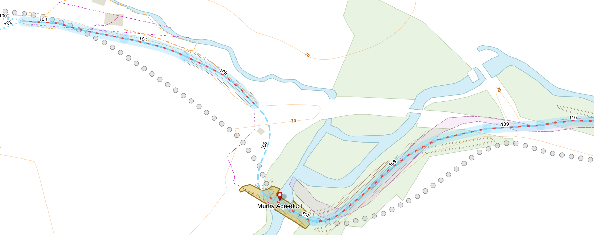
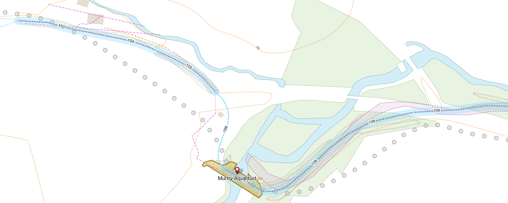

# Example Web Map: Dorset & Somerset Canal

[**Open the Web Map**](https://richard-thomas.github.io/qgis-web-map-exporter/examples/D%2BS%20canal/webmap/web_map_viewer.html) - directly view the generated interactive web page in your browser

Output Web map files are in sub-folder [examples/D+S canal/webmap/](webmap/):
- [data/](webmap/data/) - exported data files
- [styles/](webmap/styles/) - exported SLD style files
- [map_config.js](https://richard-thomas.github.io/qgis-web-map-exporter/examples/D%2BS%20canal/webmap/map_config.js) - exported Map Configuration (JSONP)
- [web_map_viewer.html](webmap/web_map_viewer.html) - common HTML template copied from folder web_map_viewer/
- [web_map_viewer.js](webmap/web_map_viewer.js) - common JavaScript template copied from folder web_map_viewer/ (modified just to comment out hard-wired OSM base map)

Source QGIS Project and source data files in folder [examples/D+S canal/](.):
- D+S Canal example.qgz
- QGIS Packaged Layers (D+S Canal).gpkg
- QGIS Packaged Layers (OS Open Data).gpkg

## Web Map Exporter UI Settings

'Layers' and 'Options' tab settings used to generate this web map (scrollbar hides the lower layers):

## Comparison with source QGIS Project Styling

QGIS canvas screenshot (Murtry Viaduct):

Web map screenshot (Murtry Viaduct):

Key limitations of Web Map Exporter displayed in this example:
- Layer 'Notable features (SVG Marker):
    - currently doesn't export SVG files to webmap folder, though as a temporary workaround QGIS built-in SVGs like this red-marker.svg are redirected to the GitHub QGIS files.
- Layer 'Probable path evidence':
    - dashed line spacing too close due to QGIS bug that doesn't scale "stroke-dasharray" by "stroke-width"
    - labels on line instead of above line (as specified in QGIS)
- Layer 'OS 1st edition (SVG Fill)', rule 'Hachure':
    - Hachure lines too close due to 2 SLD issues: QGIS bug that doesn't scale "stroke-dasharray" by "stroke-width", but more importantly rendering of "stroke-dasharray" by SLDReader not in specified units of measurement for this line symbolizer.
- Layer 'OS 1st edition (SVG Fill)', rule 'March':
    - currently don't export SVG files to webmap folder, though as a temporary workaround QGIS built-in SVGs like this landuse_swamp.svg are redirected to the GitHub QGIS files.
- (General): Labels overlap when zoomed out. Although you could set 'declutter' for layers in OpenLayers this would also hide overlapping features.
