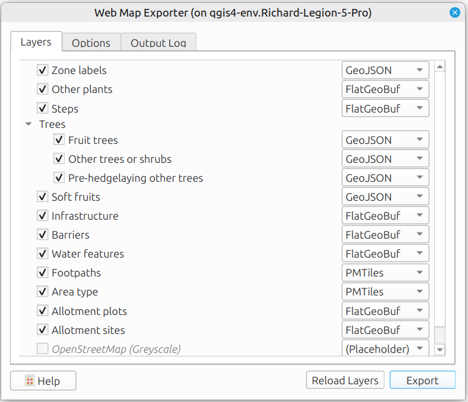
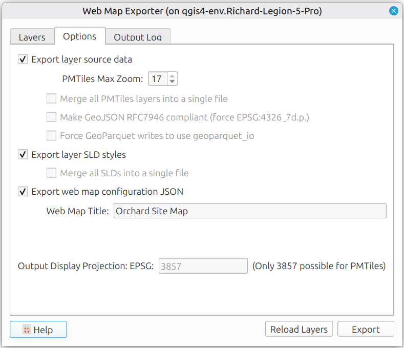
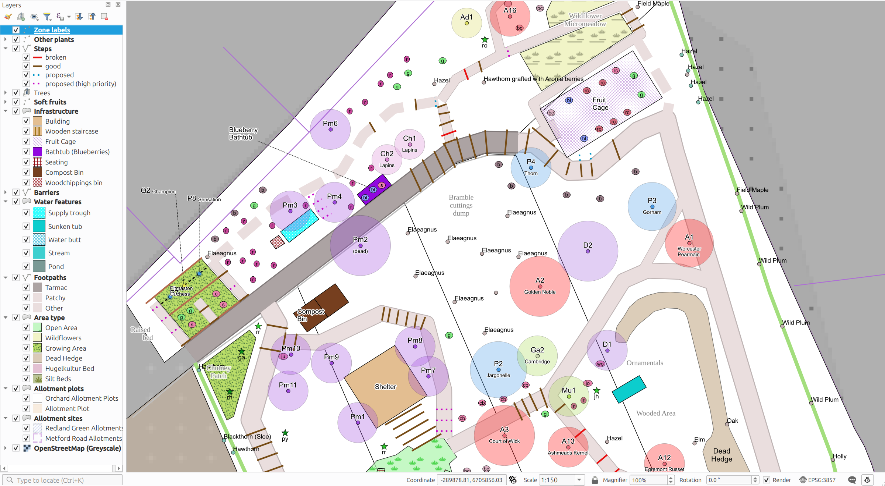
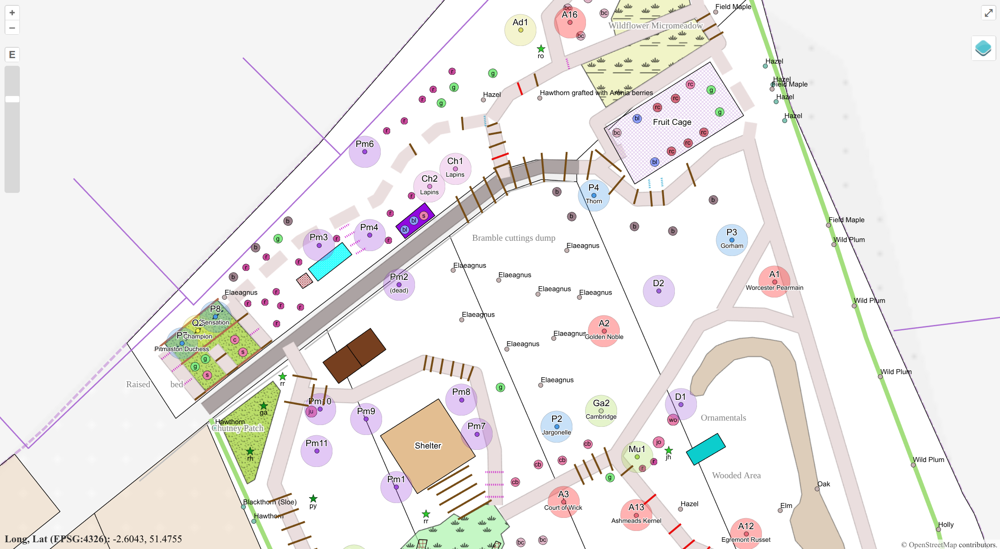

# Example Web Map: Orchard Site Map

[**Open the Web Map**](https://richard-thomas.github.io/qgis-web-map-exporter/examples/orchard%20site%20map/webmap/web_map_viewer.html) - directly view the generated interactive web page in your browser

Output Web map files are in sub-folder [examples/orchard site map/webmap/](webmap/):
- [data/](webmap/data/) - exported data files
- [styles/](webmap/styles/) - exported SLD style files
- [map_config.js](https://richard-thomas.github.io/qgis-web-map-exporter/examples/orchard%20site%20map/webmap/map_config.js) - exported Map Configuration (JSONP)
- [web_map_viewer.html](webmap/web_map_viewer.html) - common HTML template copied from folder web_map_viewer/
- [web_map_viewer.js](webmap/web_map_viewer.js) - common JavaScript template copied from folder web_map_viewer/

Source QGIS Project and source data files in folder [examples/orchard site map/](.):
- Orchard site example.qgz
- mrco_site_interactive.gpkg

## Web Map Exporter UI Settings

'Layers' and 'Options' tab settings used to generate this web map (scrollbar hides the lower layers):




## Comparison with source QGIS Project Styling

QGIS canvas screenshot:



Web map screenshot:



Key limitations of Web Map Exporter displayed in this example:
- Layer 'Area type':
    - currently doesn't export SVG files to webmap folder, though as a temporary workaround QGIS built-in SVGs like these are redirected to the GitHub QGIS files. A warning is given in the 'Output Log' tab:
```
WARNING: replacing QGIS local SVG path with GitHub version in 'Area type.sld'
```
- Layer 'Fruit trees':
    - crowns (the outer circles) different in size for 2 reasons: web map do not scale to map units as SLD will not allow mixing of units of measurement (map units and mm); data-defined values not exported from QGIS
    - label callouts (on far left) not supported in web map
- Layer 'Steps', rule 'proposed':
    - dotted line spacing too close due to QGIS bug that doesn't scale "stroke-dasharray" by "stroke-width" for predefined dash patterns
- Layer 'Footpaths':
    - data-defined widths ignored in web map, but widths do scale to honour unit of measurement 'map units'
    - overlapping of different path types handled differently
- Layer 'Soft fruits':
    - (letters in ellipse): ellipse is vendor-specific SLD so only renders as a circle in web map
- Layer 'Area Type', rule 'Open Area':
    - (green tufts of grass): green stroke colour of SVG grass is ignored (rendered black)
- (General): Word wrap settings on labels not in web map
- (General): Labels overlap when zoomed out. Although you could set 'declutter' for layers in OpenLayers this would also hide overlapping features.
